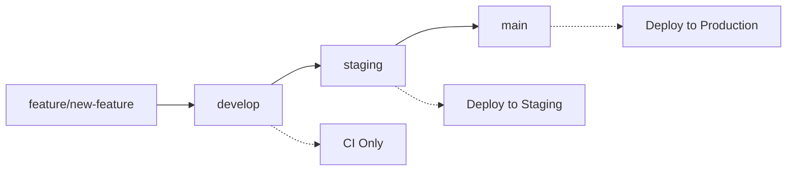

# 🌿 Estrategia de Branches para Railway

## 📋 **Flujo de trabajo GitFlow + Railway**



## 🚀 **Branches y Ambientes**

| Branch | Ambiente | Deploy Automático | Tests |
|--------|----------|-------------------|-------|
| `develop` | Ninguno | ❌ Solo CI | Unit + Integration |
| `staging` | Staging Railway | ✅ Auto | **E2E completos** |
| `main` | Production Railway | ✅ Auto | **Smoke tests** |

## 🔄 **Proceso de desarrollo**

### **1. Desarrollo de features:**
```bash
# Crear feature branch desde develop
git checkout develop
git pull origin develop
git checkout -b feature/mi-nueva-feature

# Desarrollar...
git add .
git commit -m "feat: nueva funcionalidad"
git push origin feature/mi-nueva-feature

# Crear PR a develop
```

### **2. Integración en develop:**
```bash
# Merge PR a develop → Solo CI se ejecuta
# ✅ Unit tests
# ✅ Integration tests  
# ✅ Lint, format, type check
# ❌ NO deploy
```

### **3. Release a staging:**
```bash
# Cuando develop esté listo para staging
git checkout staging
git pull origin staging
git merge develop
git push origin staging

# Trigger:
# ✅ CI completo
# ✅ Deploy a Railway staging
# ✅ E2E tests COMPLETOS contra staging (10-20 min)
```

### **4. Release a production:**
```bash
# Cuando staging esté validado
git checkout main
git pull origin main  
git merge staging
git push origin main

# Trigger:
# ✅ CI completo
# ✅ Deploy a Railway production  
# ✅ SMOKE tests rápidos (2-3 min)
```

## 🔧 **Configuración de protección de branches**

### **GitHub Branch Protection Rules:**

#### **develop:**
- ✅ Require pull request reviews
- ✅ Require status checks to pass
- ✅ Require CI to pass
- ❌ Allow force pushes

#### **staging:**
- ✅ Require pull request reviews  
- ✅ Require status checks to pass
- ✅ Require CI + deploy to pass
- ❌ Allow force pushes
- ✅ Restrict pushes to admins only

#### **main:**
- ✅ Require pull request reviews
- ✅ Require status checks to pass  
- ✅ Require staging to be up to date
- ✅ Require E2E tests to pass
- ❌ Allow force pushes
- ✅ Restrict pushes to admins only

## 🚨 **Hotfixes**

Para correcciones urgentes en producción:

```bash
# Crear hotfix desde main
git checkout main
git checkout -b hotfix/critical-bug

# Fix...
git commit -m "fix: critical bug"

# PR directo a main (excepción)
# Después hacer PR a staging y develop
```

## 🧪 **Estrategia de Testing**

### **Testing por ambiente:**

#### **Develop (Local/CI):**
- ✅ Unit tests
- ✅ Integration tests  
- ✅ Lint, format, type check
- ❌ NO E2E (no hay ambiente)

#### **Staging:**
- ✅ E2E tests COMPLETOS (10-20 min)
- ✅ Tests de flujos críticos
- ✅ Tests de regresión
- ✅ Tests de integración frontend-backend
- ✅ Performance tests básicos

#### **Production:**
- ✅ Smoke tests RÁPIDOS (2-3 min)
- ✅ Health checks
- ✅ Login básico
- ✅ Páginas críticas cargan
- ✅ API responde
- ❌ NO cambios en BD

## 📊 **Ventajas de esta estrategia**

✅ **Develop** = Integración continua sin ruido en staging  
✅ **Staging** = Testing completo en ambiente real  
✅ **Production** = Deploy rápido con verificación básica  
✅ **E2E** = Solo donde tiene sentido (staging)  
✅ **Smoke** = Verificación rápida en production  
✅ **Rollback** = Fácil con Railway  

## 🎯 **URLs de ambientes**

- **Develop**: Localhost / CI only
- **Staging**: `https://miamente-staging.railway.app`
- **Production**: `https://miamente.railway.app`
